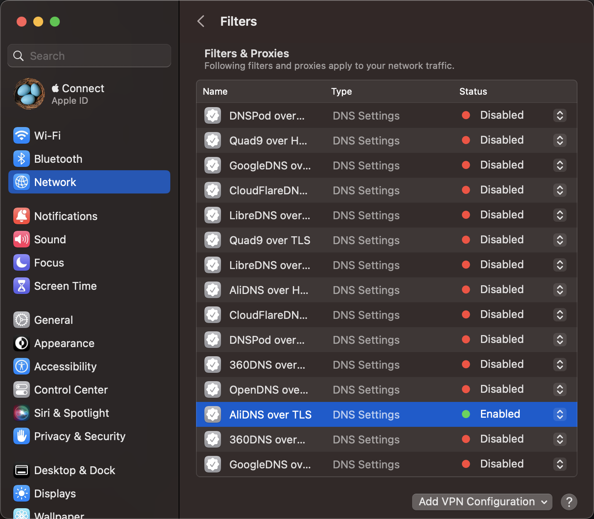

# DoH (DNS over HTTPS) mobileconfig

DoH (DNS over HTTPS) mobileconfig, [View on GitHub](https://github.com/cntrump/dns-mobileconfig)

Availability: `iOS 14.0+`, `macOS 11.0+`

[The payload for configuring encrypted DNS settings.](https://developer.apple.com/documentation/devicemanagement/dnssettings)

## Install

Enable DoH/T on macOS 13: `System Settings` -> `Network` -> `Filters`, selecte installed DNS settings and enable.



### AliDNS

[alidns.mobileconfig](alidns.mobileconfig)

```html
<key>DNSSettings</key>
<dict>
    <key>DNSProtocol</key>
    <string>HTTPS</string>
    <key>ServerAddresses</key>
    <array>
        <string>223.5.5.5</string>
        <string>223.6.6.6</string>
        <string>2400:3200::1</string>
        <string>2400:3200:baba::1</string>
    </array>
    <key>ServerURL</key>
    <string>https://dns.alidns.com/dns-query</string>
</dict>
```

### DNSPod

[dnspod.mobileconfig](dnspod.mobileconfig)

```html
<key>DNSSettings</key>
<dict>
    <key>DNSProtocol</key>
    <string>HTTPS</string>
    <key>ServerAddresses</key>
    <array>
        <string>119.29.29.29</string>
    </array>
    <key>ServerURL</key>
    <string>https://doh.pub/dns-query</string>
</dict>
```

### 360DNS

[360dns.mobileconfig](360dns.mobileconfig)

```html
<key>DNSSettings</key>
<dict>
    <key>DNSProtocol</key>
    <string>HTTPS</string>
    <key>ServerAddresses</key>
    <array>
        <string>101.226.4.6</string>
        <string>218.30.118.6</string>
        <string>123.125.81.6</string>
        <string>140.207.198.6</string>
    </array>
    <key>ServerURL</key>
    <string>https://doh.360.cn/dns-query</string>
</dict>
```

### CloudFlare DNS

[cloudflaredns.mobileconfig](cloudflaredns.mobileconfig)

```html
<key>DNSSettings</key>
<dict>
    <key>DNSProtocol</key>
    <string>HTTPS</string>
    <key>ServerAddresses</key>
    <array>
        <string>1.1.1.1</string>
        <string>1.0.0.1</string>
        <string>2606:4700:4700::1111</string>
        <string>2606:4700:4700::1001</string>
    </array>
    <key>ServerURL</key>
    <string>https://cloudflare-dns.com/dns-query</string>
</dict>
```

### Google DNS

[googledns.mobileconfig](googledns.mobileconfig)

```html
<key>DNSSettings</key>
<dict>
    <key>DNSProtocol</key>
    <string>HTTPS</string>
    <key>ServerAddresses</key>
    <array>
        <string>8.8.8.8</string>
        <string>8.8.4.4</string>
        <string>2001:4860:4860::8888</string>
        <string>2001:4860:4860::8844</string>
    </array>
    <key>ServerURL</key>
    <string>https://dns.google/dns-query</string>
</dict>
```

### OpenDNS

[opendns.mobileconfig](opendns.mobileconfig)

```html
<key>DNSSettings</key>
<dict>
    <key>DNSProtocol</key>
    <string>HTTPS</string>
    <key>ServerAddresses</key>
    <array>
        <string>208.67.222.222</string>
        <string>208.67.220.220</string>
        <string>2620:119:35::35</string>
        <string>2620:119:53::53</string>
    </array>
    <key>ServerURL</key>
    <string>https://doh.opendns.com/dns-query</string>
</dict>
```

### Quad9 DNS

[quad9dns.mobileconfig](quad9dns.mobileconfig)

```html
<key>DNSSettings</key>
<dict>
    <key>DNSProtocol</key>
    <string>HTTPS</string>
    <key>ServerAddresses</key>
    <array>
        <string>9.9.9.9</string>
        <string>149.112.112.112</string>
        <string>2620:fe::fe</string>
        <string>2620:fe::9</string>
    </array>
    <key>ServerURL</key>
    <string>https://dns.quad9.net/dns-query</string>
</dict>
```

### LibreDNS

[libredns.mobileconfig](libredns.mobileconfig)

```html
<key>DNSSettings</key>
<dict>
    <key>DNSProtocol</key>
    <string>HTTPS</string>
    <key>ServerAddresses</key>
    <array>
        <string>116.202.176.26</string>
    </array>
    <key>ServerURL</key>
    <string>https://doh.libredns.gr/dns-query</string>
</dict>
```
